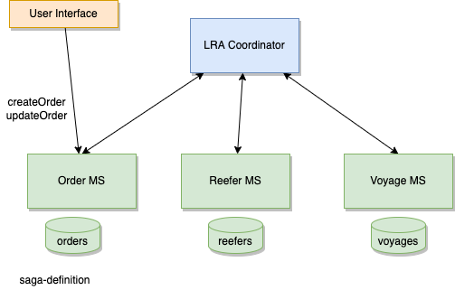
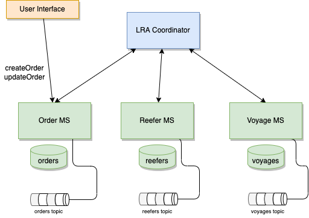

# SAGA with Long Running Action Demonstration

This is a simple demonstration of how to use Quarkus LRA to support the Fresh found delivery long running process.


## Concepts

Saga: is the solution for distributed long running transaction. In Saga, a compensating transaction must be idempotent and retryable.

Saga as atomicity, consistency, durability but is not isolated.


### Extended reading

* [Saga design pattern explain in EDA](https://ibm-cloud-architecture.github.io/refarch-eda/patterns/saga/)
* [Narayana-LRA](https://jbossts.blogspot.com/2021/07/narayana-lra-update.html)
* [Open Liberty LRA support 01/21](https://openliberty.io/blog/2021/01/27/microprofile-long-running-actions-beta.html)

## How the solution works

A single-page user interface application is sending an order to ship good over seas to the order management service. The creation of the order, triggers the saga.



A long running action coordinator is an external process that manage the orchestration of the SAGA.

Each participant will expose method participating to the SAGA and how to compensate in case of failure.

### Order microservice

This the SAGA process definition: it defines two saga end points for order creation and order update, and one compensation method. See the class [OrderResource](https://github.com/jbcodeforce/saga-lra-quarkus/blob/main/order-ms/src/main/java/org/acme/orderms/infra/api/OrderResource.java)

```java
@POST
@LRA(value = LRA.Type.REQUIRES_NEW, end=false)
@Counted(name = "performedNewOrderCreation", description = "How many post new order have been performed.")
@Timed(name = "checksTimer", description = "A measure of how long it takes to perform the operation.", unit = MetricUnits.MILLISECONDS)
public OrderDTO saveNewOrder(@HeaderParam(LRA_HTTP_CONTEXT_HEADER) URI lraId, OrderDTO order) {
```

And the service class has the process definition See class [OrderService](https://github.com/jbcodeforce/saga-lra-quarkus/blob/main/order-ms/src/main/java/org/acme/orderms/domain/OrderService.java):

```java 
        try {
			repository.addOrder(order);
			assignReeferContainer(order);
			assignVoyage(order);

		} catch(Exception e) {
			e.printStackTrace();
		}
```

### Reefer microservice

It exposes two APIs:

* Main business function to support the saga. It uses the LRA annotation from the Microprofile LRA api to specify
to be part of a LRA and do not end it.

```java
    @LRA(value = LRA.Type.REQUIRED, end=false)
    @POST
    @Path("/assignOrder")
    @Consumes(MediaType.APPLICATION_JSON)
    public Response processOrder(@HeaderParam(LRA_HTTP_CONTEXT_HEADER) URI lraId, OrderDTO order)
```

The OrderDTO is a view of Order for the participants of the Saga to work with.

```java
public class OrderDTO {
	public String orderID;
	public String productID;
	public int quantity;
	public String destinationCity;
	public String pickupCity;
	public String containerIDs;
	public String creationDate;
```

* Compensate method is call if a participant failed:

```java
 @Compensate
    @Path("/compensateOrder")
    @PUT
    public Response compensateOrder(@HeaderParam(LRA_HTTP_CONTEXT_HEADER) URI lraId, OrderDTO order) 
```

## How to demonstrate it

1. Start the solution

    ```sh
    docker-compose up -d
    ```

1. Verify the current Reefers are all free

    ```sh
    curl -X 'GET' 'http://localhost:8083/api/v1/reefers' -H 'accept: application/json' | json_pp 
    ```

    C01 is the target container for the order

    ```json
   {
      "brand" : "Binder",
      "capacity" : 100,
      "creationDate" : null,
      "currentFreeCapacity" : 0,
      "location" : "San Francisco",
      "reeferID" : "C01",
      "status" : "free",
      "type" : "B13"
   }
    ```

    You can also use the integrated Swagger-ui

    ```sh
    chrome http://localhost:8083/q/swagger-ui
    ```

1. List the current orders


    ```sh
    chrome http://localhost:8080/q/swagger-ui
    ```

    or

    ```sh
    curl -X 'GET' 'http://localhost:8080/api/v1/orders' -H 'accept: application/json' | json_pp 
    ```


1. Create an order that works

    ```sh
    ./e2e/createGoodOrder.sh
    ```

1. Verify one fo the Reefer is allocated (should reefer C01)

   ```sh
    curl -X 'GET' 'http://localhost:8083/api/v1/reefers' -H 'accept: application/json' | json_pp 
    ```


1. Create an order that will make the voyage responding badly so the SAGA compensate

  
    ```sh
    ./e2e/createOrderWrongDestination.sh
    ```

    The orderms logs should display a 500 exception, it was generated by voyage microservice. The transaction will be compensaged. The Allocated Reefer should be now free and at full capacity

    ```sh
     curl -X 'GET' 'http://localhost:8083/api/v1/reefers/C01' -H 'accept: application/json' | json_pp 
    ```

## Add events

